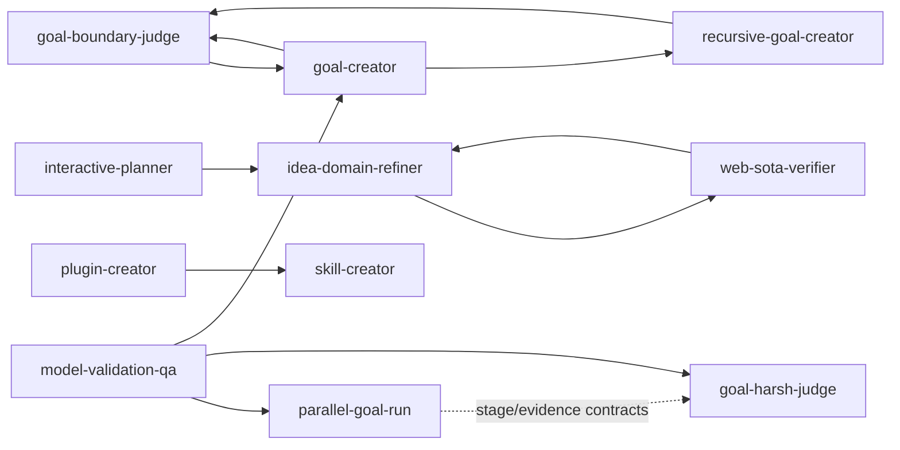

<!-- markdownlint-disable MD013 -->

# Skills Architecture and Functional Flow

## Scope

This report maps the skills under `/workspace/.codex/skills`, their functional
groupings, explicit handoffs, shared contracts, and loop relationships.

## Skills Overview

| Skill | Utility Group | One-line Functionality | Passes Into |
|---|---|---|---|
| `goal-boundary-judge` | Orchestration (Goals) | Decides whether a goal should be updated, created, broken down, or merged up. | `goal-creator` |
| `goal-creator` | Orchestration (Goals) | Builds or updates non-recursive goal scopes with staged evidence contracts. | `goal-boundary-judge`, `recursive-goal-creator` |
| `goal-harsh-judge` | Orchestration (Execution Gate) | Applies strict completion and QA acceptance gates to finished goal steps. | Terminal gate for execution outcomes |
| `parallel-goal-run` | Orchestration (Execution) | Executes active goals with dependency-aware staged parallelism. | `goal-harsh-judge` (by contract), execution artifacts |
| `recursive-goal-creator` | Orchestration (Goals) | Maintains one supergoal family with non-overlapping subgoal structure. | `goal-boundary-judge`, goal-family artifacts |
| `interactive-planner` | Orchestration (Planning) | Runs interactive planning and escalates persona-specific analysis. | `idea-domain-refiner` |
| `idea-domain-refiner` | Strategy | Converts raw ideas into domain-ready concept briefs and validation packets. | `web-sota-verifier` (optional), `interactive-planner` outputs |
| `web-sota-verifier` | Strategy (Online Verification) | Verifies concept novelty/feasibility with citation-backed external evidence. | Verified strategy packet (feeds planning/decision) |
| `model-validation-qa` | Validation (ML/Arch) | Validates model/architecture changes on deterministic subsets before full runs. | Aligns to `goal-creator`, `parallel-goal-run`, `goal-harsh-judge` contracts |
| `playwright-testing-qa` | Validation (UI Local) | Performs deterministic Playwright QA with markers, traces, videos, and action logs. | UI evidence artifacts for local QA gates |
| `codex-setup` | Validation (Setup) | Standardizes reproducible Python/API/UI/integration test setup and contracts. | Test plans and artifact conventions for downstream validation |
| `update-dependencies` | Validation (Dependency Hygiene) | Safely updates Python dependencies with reproducible verification. | Stable runtime/tooling for local validation and execution |
| `skill-creator` | System (Skill Authoring) | Defines process and standards to create or update skills. | `quick_validate.py`, creation/update lifecycle |
| `skill-installer` | System (Distribution) | Installs curated or GitHub-hosted skills into discoverable skill locations. | Installed skills available to runtime |
| `plugin-creator` | System (Plugin Authoring) | Scaffolds Codex plugins and marketplace entries with manifest validation. | Uses `skill-creator` validation conventions |
| `foldersummary-report` | System (Reporting) | Produces structured architecture reports from skill folders with dependency/loop mapping. | `skills-architecture.md`-style outputs |
| `openai-docs` | System (Docs/RAG) | Retrieves official OpenAI/Codex documentation with source-priority workflow. | Evidence-backed product/API guidance |
| `imagegen` | System (Media) | Produces/edits raster images and supports transparent-output workflows. | Generated visual artifacts |

## High-Level Hierarchy

```mermaid
flowchart TD
  A[Skills Root] --> B[System]
  A --> C[Orchestration]
  A --> D[Validation]
  A --> E[Strategy]

  B --> B1[skill-creator]
  B --> B2[skill-installer]
  B --> B3[plugin-creator]
  B --> B4[foldersummary-report]
  B --> B5[openai-docs]
  B --> B6[imagegen]

  C --> C1[goal-boundary-judge]
  C --> C2[goal-creator]
  C --> C3[recursive-goal-creator]
  C --> C4[parallel-goal-run]
  C --> C5[goal-harsh-judge]
  C --> C6[interactive-planner]
  C --> C7[contracts: goal_schema, stage_gate, evidence]

  D --> D1[codex-setup]
  D --> D2[model-validation-qa]
  D --> D3[playwright-testing-qa]
  D --> D4[update-dependencies]

  E --> E1[idea-domain-refiner]
  E --> E2[web-sota-verifier]
```

## Dependency and Loop Diagram

## Utility Groups and Explicit Pass-Through

### 1) Goal and Planning Orchestration

- `goal-boundary-judge` supplies the scope decision used by `goal-creator` and recursive workflows.
- `goal-creator` handles standard scopes and hands off recursive families to `recursive-goal-creator`.
- `recursive-goal-creator` uses contracts and `goal-boundary-judge` to maintain canonical family files.
- `parallel-goal-run` executes staged work against `goal_schema.md`, `stage_gate.md`, and `evidence.md`.
- `goal-harsh-judge` validates completion evidence after execution.
- `interactive-planner` is the planning front-end and escalates domain analysis to strategy skills.

### 2) Strategy and External Verification

- `idea-domain-refiner` produces structured concept briefs and optional verification packets.
- `web-sota-verifier` consumes those packets for web-backed novelty/feasibility checks.
- Loop: verifier can request deeper refinement; refiner can re-issue improved packets.
- `interactive-planner` can call `idea-domain-refiner` and fold outputs into planning artifacts.

### 3) Validation and Testing (Local + Contract-Driven)

- `playwright-testing-qa` generates deterministic UI QA artifacts.
- `model-validation-qa` binds ML/architecture validation to orchestration contracts.
- `codex-setup` defines reproducible setup and artifact-path conventions.
- `update-dependencies` stabilizes Python runtime/tooling for reproducible validation.

### 4) System, Docs, and Asset Tooling

- `skill-creator` is the process authority for creating and updating skills.
- `skill-installer` is the distribution path for installing skills.
- `plugin-creator` scaffolds plugin projects and reuses `skill-creator` validation rules.
- `foldersummary-report` standardizes folder-level skill architecture documentation.
- `openai-docs` handles official OpenAI/Codex documentation retrieval.
- `imagegen` handles raster generation/editing and transparency post-processing.

## Shared Contract Layer (Critical Internal Dependency)

`orchestration/contracts` is a common dependency for goal lifecycle skills:

- `goal_schema.md`
- `stage_gate.md`
- `evidence.md`

This layer standardizes naming, stage gates, and evidence expectations across creation, execution, and harsh judging.

## Main Closed Loops

1. `goal-boundary-judge -> goal-creator -> goal-boundary-judge`
2. `idea-domain-refiner -> web-sota-verifier -> idea-domain-refiner`
3. `goal-creator -> recursive-goal-creator -> goal-boundary-judge -> goal-creator`

## Notes on Reliability

- Explicit links in SKILL files define hard pass-throughs.
- Contract references define strong coupling for orchestration skills.
- Some downstream outcomes are artifact-based rather than direct skill-to-skill calls.
